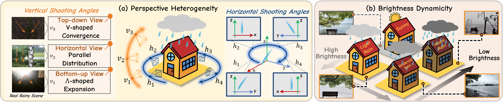

<h1 align="center">
  
  Rethinking Rainy 3D Scene Reconstruction via Perspective Transforming and Brightness Tuning<br>
  <sub><b>[AAAI 2026]</b></sub>
</h1>

<!-- 强制换行，防止 GitHub Markdown 阻断 -->
<!-- -->

> [Qianfeng Yang](https://ncfjd.github.io/)* <sup>1</sup>, [Xiang Chen](https://cschenxiang.github.io/)* <sup>2</sup>, [Pengpeng Li](https://scholar.google.com/citations?user=Y-VG6gMAAAAJ&hl=zh-CN&oi=sra) <sup>2</sup>, [Qiyuan Guan](https://guanqiyuan.github.io/)<sup>1</sup>, Guiyue Jin <sup>1</sup>, Jiyu Jin <sup>1</sup>  
> Dalian Polytechnic University<sup>1</sup>, Nanjing University of Science and Technology<sup>2</sup>

> [[Paper](http://arxiv.org/abs/2511.06734)]

 **👉️ Welcome to visit our website (专注底层视觉领域的信息服务平台) for low-level vision:[https://lowlevelcv.com/](https://lowlevelcv.com/)**

---
<p align="center">
  
</p>

*Key characteristics in real rainy scenes. (a) **Perspective Heterogeneity**: Rain streaks vary in appearance across both vertical and horizontal directions, as shown in real observations. (b) **Brightness Dynamicity**: An increase in rainfall is often accompanied by a decrease in ambient brightness, as confirmed by images ranging from sunny to heavy rain conditions.*

---
### 🚩 **New Features** 
- ✅ 🎉 Our paper was accepted by **AAAI 2026**!

### ⚡ **To Do**
- [x] Release code
- [x] Release dataset
---

## :book: Dataset
### 🔎 Visual of OmniRain3D
<p align='left'>


</p>


### ⬇️ Dataset Download
|Scenes| Download Link | 
|---------|---------|
|Family| [Google Drive](https://drive.google.com/drive/folders/1LtvERVGsHPCG0ZIQSkEhB-M9DEii7eHU?usp=drive_link) | 
|Horse | [Google Drive](https://drive.google.com/drive/folders/1a77De7Zqb0-S7Wfl0A6KAuW4bSCWOak-?usp=drive_link) | 
|Francis| [Google Drive](https://drive.google.com/drive/folders/1U9rQCVCwp6HLvmsTyAeiUek6KgDz0nXH?usp=drive_link) | 
|Caterpillar| [Google Drive](https://drive.google.com/drive/folders/19F0V9TSL0I64UT2q5JRcXl0KvskTYOML?usp=drive_link) | 
|Truck | [Google Drive](https://drive.google.com/drive/folders/1MQLC1LVoFeqrCNDz2B44KJC8eVvZoLs2?usp=drive_link)| 
|Garden | [Google Drive](https://drive.google.com/drive/folders/1pdXTfU8sGDZSYwed0YZktSXm9ru0G98x?usp=drive_link)| 
|Lgnatius | [Google Drive](https://drive.google.com/drive/folders/1h8IS3g_-tG7VIsB6q7N5ofGLTR_Pmoib?usp=drive_link)| 
---


## 👍 Acknowledgement

Thanks for their awesome works ([3DGS](https://github.com/graphdeco-inria/gaussian-splatting) and [RainyScape](https://github.com/lyuxianqiang/RainyScape))

---

## ❣ Citation
```
@article{

}
```

---

## 📧 Contact
If you have any questions, please feel free to contact csqianfengyang@163.com.
